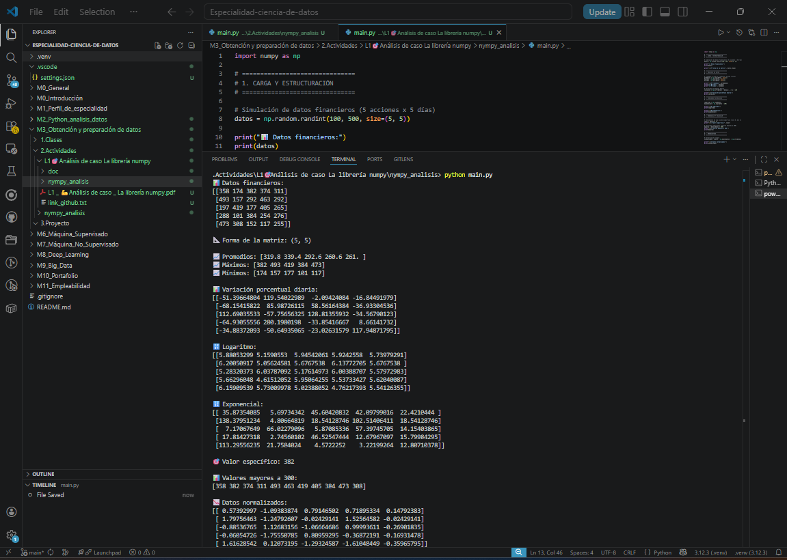

# 📊 Análisis de Datos con NumPy

## 🔹 1. Introducción

En este proyecto se utilizó la librería NumPy para analizar datos financieros simulados. El objetivo fue optimizar el procesamiento de datos mediante estructuras vectorizadas y operaciones eficientes.

---

## 🔹 2. Carga y estructuración de datos

Se creó una matriz de 5x5 donde cada fila representa una acción y cada columna un día de cotización.

Se utilizó:
- np.random.randint()

Esto permite simular datos de forma rápida y eficiente.

---

## 🔹 3. Análisis de datos

Se calcularon:
- Promedio (np.mean)
- Máximo (np.max)
- Mínimo (np.min)

También se calculó la variación porcentual diaria utilizando operaciones vectorizadas.

---

## 🔹 4. Transformaciones matemáticas

Se aplicaron funciones como:
- Logaritmo (np.log)
- Exponencial (np.exp)

Estas funciones permiten analizar el comportamiento de los datos.

---

## 🔹 5. Selección e indexación

Se accedió a datos específicos mediante índices.

También se filtraron valores utilizando condiciones:
datos > 300

---

## 🔹 6. Broadcasting

Se aplicó normalización de datos sin necesidad de bucles, utilizando broadcasting.

---

## 🔹 7. Comparación con métodos tradicionales

Sin NumPy:
- Se necesitarían bucles (for)
- Código más largo
- Menor eficiencia

Con NumPy:
- Operaciones vectorizadas
- Mayor velocidad
- Código más limpio

---

## 🔹 8. Anexo

---

## 🔹 9. Conclusión

NumPy permite trabajar con grandes volúmenes de datos de forma eficiente, facilitando el análisis y optimizando el rendimiento del código. Es una herramienta fundamental en ciencia de datos.