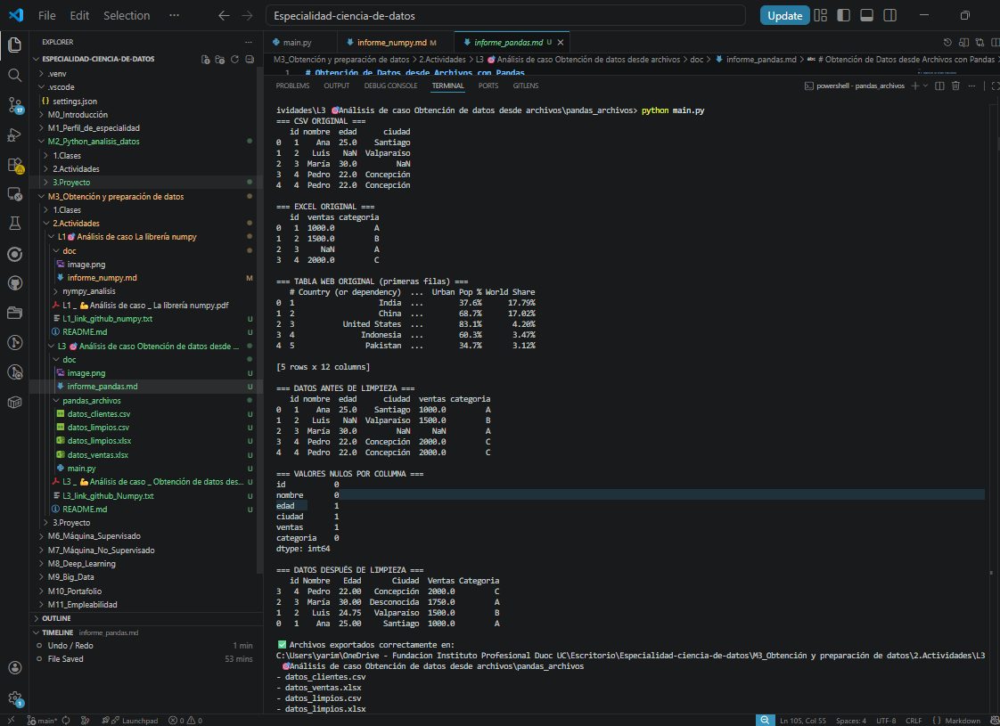

# 📊 Obtención de Datos desde Archivos con Pandas

## 🔹 1. Introducción

En este proyecto se utilizó la librería Pandas para la obtención, limpieza y transformación de datos provenientes de múltiples fuentes. El objetivo fue automatizar el procesamiento de datos, evitando tareas manuales y mejorando la eficiencia del análisis.

---

## 🔹 2. Carga de datos

Se trabajó con tres fuentes de información:

* Archivo CSV (clientes)
* Archivo Excel (ventas)
* Tabla web obtenida con `read_html()`

Los datos fueron cargados utilizando:

* `pd.read_csv()`
* `pd.read_excel()`
* `pd.read_html()`

Para la obtención de datos desde la web, se utilizó la función `read_html()` de Pandas.

Debido a restricciones de acceso de algunas páginas web (HTTP 403), se implementó un manejo de errores utilizando `try/except`, permitiendo que el programa continúe su ejecución mediante el uso de un dataset de respaldo. Esto garantiza la continuidad del flujo de procesamiento de datos sin interrupciones.

---

## 🔹 3. Datos antes de la limpieza

Se observó que los datos presentaban:

* Valores nulos en columnas como edad, ciudad y ventas
* Registros duplicados
* Información separada en diferentes archivos

Se realizó una unión de los datos mediante la columna `id` para consolidar la información en un solo DataFrame.

---

## 🔹 4. Limpieza y estructuración

Se aplicaron las siguientes técnicas:

* Identificación de valores nulos con `isnull()`
* Reemplazo de valores faltantes:

  * Edad → promedio
  * Ventas → mediana
  * Ciudad → "Desconocida"
* Eliminación de duplicados con `drop_duplicates()`
* Conversión de tipos de datos con `astype()`

---

## 🔹 5. Transformación de datos

Se realizaron transformaciones para mejorar la estructura:

* Selección de columnas relevantes
* Renombrado de columnas
* Ordenamiento por ventas (descendente)

---

## 🔹 6. Exportación de datos

Los datos procesados fueron exportados a:

* CSV (`to_csv`)
* Excel (`to_excel`)

Esto permite reutilizar la información limpia en futuros análisis.

---

## 🔹 7. Comparación con métodos tradicionales

Sin Pandas:

* Uso de bucles (for)
* Código más largo
* Mayor probabilidad de errores

Con Pandas:

* Procesamiento vectorizado
* Código más limpio
* Mayor eficiencia

---

## 🔹 8. Anexo

---

## 🔹 9. Conclusión

Pandas permite trabajar con grandes volúmenes de datos de forma eficiente, facilitando la obtención, limpieza y transformación de la información. Su uso mejora la calidad de los datos y optimiza el tiempo de procesamiento, siendo una herramienta fundamental en ciencia de datos.
