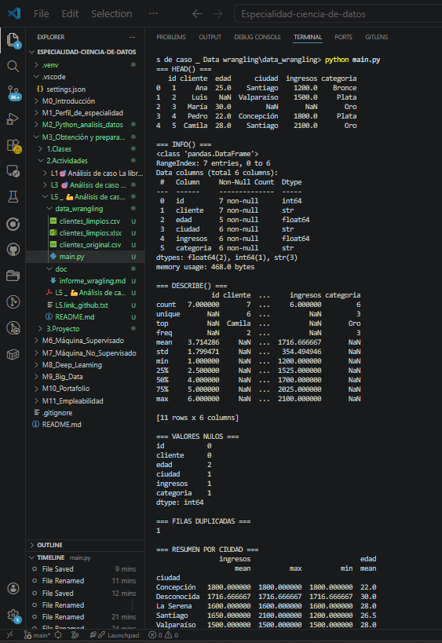
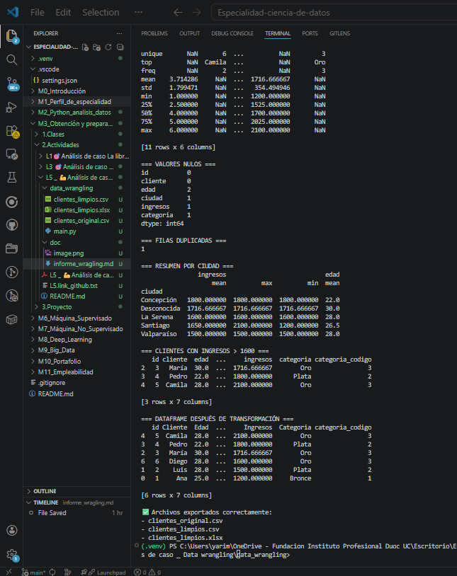

# Data Wrangling con Pandas

## 1. Introducción

En esta actividad se desarrolló un proceso de Data Wrangling con Pandas para mejorar la calidad y estructura de un conjunto de datos. El objetivo fue cargar información desde un archivo CSV, detectar problemas de calidad, transformar columnas y exportar un DataFrame limpio para su uso posterior en análisis y reportes.

---

## 2. Carga y exploración de datos

Se trabajó con un dataset en formato CSV que contiene información de clientes, incluyendo edad, ciudad, ingresos y categoría.

Para la exploración inicial se utilizaron:

- `head()` para visualizar las primeras filas
- `info()` para revisar la estructura del DataFrame
- `describe()` para obtener estadísticas descriptivas

Además, se identificaron valores nulos con `isnull().sum()` y registros duplicados con `duplicated().sum()`.

---

## 3. Estado de los datos antes de la limpieza

Antes de aplicar transformaciones, los datos presentaban:

- valores nulos en columnas numéricas como `edad` e `ingresos`
- valores faltantes en columnas categóricas como `ciudad` y `categoria`
- registros duplicados
- necesidad de preparar variables categóricas para análisis posterior

---

## 4. Limpieza y transformación de datos

Se aplicaron las siguientes acciones:

### 4.1 Imputación de nulos
- La columna `edad` se completó con la mediana.
- La columna `ingresos` se completó con la media.
- La columna `ciudad` se completó con el valor `"Desconocida"`.
- La columna `categoria` se completó con la moda.

### 4.2 Eliminación de duplicados
Se utilizó `drop_duplicates()` para eliminar registros repetidos.

### 4.3 Transformación de datos categóricos
La columna `categoria` se convirtió en una variable numérica mediante un mapeo:
- Bronce → 1
- Plata → 2
- Oro → 3

Esto facilita su uso en análisis posteriores o modelos analíticos.

---

## 5. Optimización y estructuración de datos

Se aplicaron distintas técnicas para mejorar la estructura del DataFrame:

- `groupby()` y agregación para resumir ingresos y edad por ciudad
- filtrado de clientes con ingresos mayores a 1600
- renombrado de columnas para mejorar la interpretación
- reorganización de columnas para una presentación más clara
- ordenamiento por ingresos en forma descendente

---

## 6. Ejemplo antes y después de la transformación

### Antes de la transformación
- Existían nulos en edad, ciudad, ingresos y categoría
- Había filas duplicadas
- La columna categórica no estaba codificada
- La estructura no estaba ordenada para análisis

### Después de la transformación
- Los valores nulos fueron imputados
- Los duplicados fueron eliminados
- La categoría fue convertida en variable numérica
- Las columnas fueron renombradas y reordenadas
- El DataFrame quedó ordenado por ingresos

---

## 7. Importancia del Data Wrangling

El Data Wrangling es una etapa fundamental en la preparación de datos, ya que permite transformar información desorganizada en un formato consistente y útil. Sin este proceso, los análisis pueden verse afectados por errores, datos incompletos o estructuras poco claras.

Pandas facilita esta tarea al ofrecer funciones rápidas y legibles para limpiar, transformar, agrupar y exportar datos.

---

## Anexos

## 8. Conclusión

La actividad permitió aplicar técnicas de Data Wrangling con Pandas para mejorar la calidad de un conjunto de datos. A través de la detección de nulos, eliminación de duplicados, transformación de variables y organización del DataFrame, se obtuvo una estructura lista para análisis y reportes.

Este proceso demuestra la importancia de trabajar con datos limpios y bien estructurados para garantizar resultados confiables en contextos empresariales y analíticos.