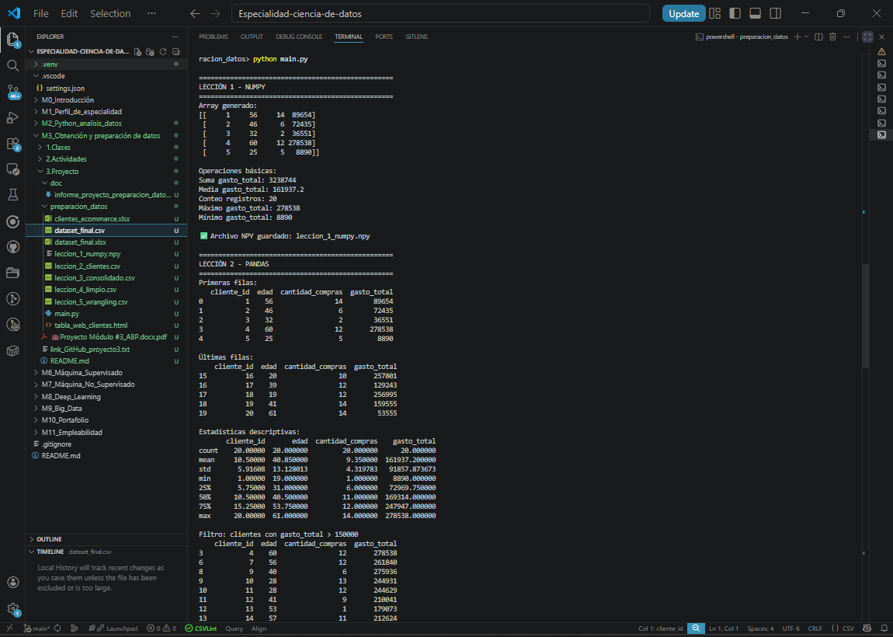
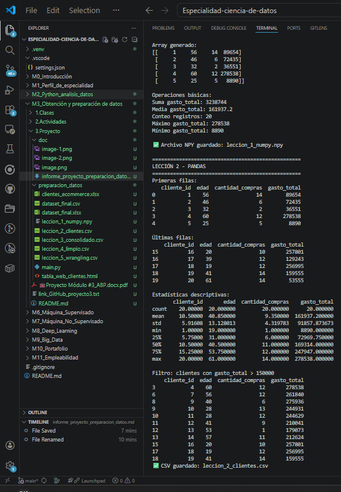
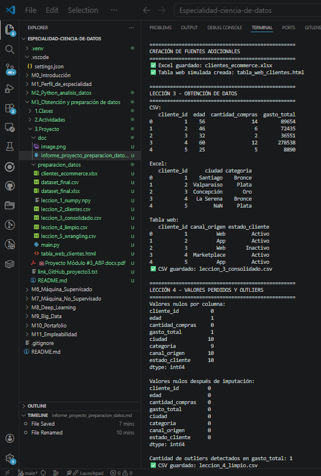
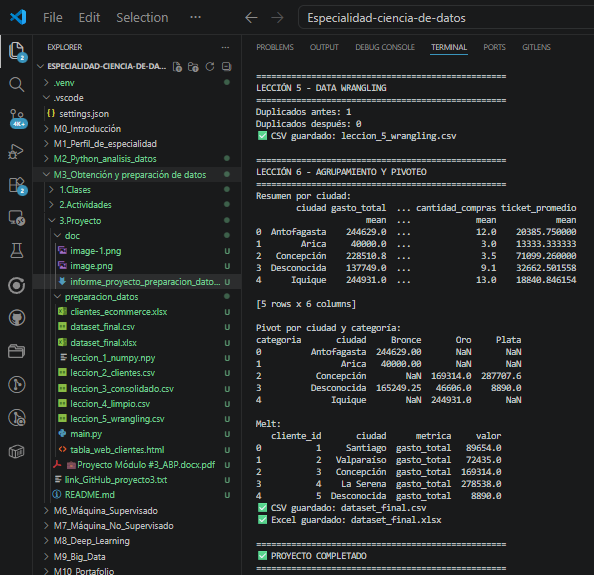

# Proyecto Integrador - Preparación de Datos con Python

## 1. Introducción

Este proyecto fue desarrollado para resolver un caso de preparación de datos en una empresa de e-commerce. El objetivo fue construir un flujo de trabajo integral para la obtención, limpieza, transformación y estructuración de datos utilizando Python con las librerías NumPy y Pandas.

El proyecto abarca seis etapas: generación de datos con NumPy, exploración con Pandas, integración de fuentes múltiples, limpieza de nulos y outliers, Data Wrangling y agrupamiento/pivoteo final para dejar el dataset listo para análisis.

---

## 2. Objetivo del proyecto

El objetivo principal fue desarrollar un proceso automatizado y eficiente para la obtención, limpieza, transformación, análisis y estructuración de datos, de manera que el resultado final sea un dataset limpio, confiable y preparado para reportes o futuros modelos predictivos.

---

## 3. Lección 1 - Uso de NumPy

En la primera etapa se generaron datos ficticios de clientes y transacciones utilizando arrays de NumPy. Se trabajó con variables como identificador de cliente, edad, cantidad de compras y gasto total.

Además, se aplicaron operaciones matemáticas básicas como suma, media, conteo, máximo y mínimo. Los datos generados fueron guardados en un archivo `.npy`, que luego fue utilizado como insumo en la segunda etapa.

### ¿Por qué NumPy es eficiente?
NumPy es eficiente porque trabaja con arreglos homogéneos optimizados para operaciones numéricas vectorizadas. Esto permite procesar grandes volúmenes de datos de manera más rápida y con menor consumo de memoria que estructuras tradicionales de Python.

---

## 4. Lección 2 - Exploración con Pandas

En esta etapa se cargaron los datos generados con NumPy y se transformaron en un DataFrame de Pandas. Luego se realizó una exploración inicial utilizando:

- `head()`
- `tail()`
- `describe()`
- filtros condicionales

Finalmente, el DataFrame preliminar fue exportado a CSV para continuar con la integración de fuentes en la siguiente lección.

### Utilidad de Pandas
Pandas facilita la manipulación de datos tabulares gracias a su estructura DataFrame, que permite filtrar, transformar, limpiar y analizar datos de manera clara y eficiente.

---

## 5. Lección 3 - Integración de múltiples fuentes

En esta fase se unificaron datos provenientes de distintas fuentes:

- CSV
- Excel
- tabla web usando `read_html()`

La combinación se realizó principalmente con `merge()` y `concat()`, generando un DataFrame consolidado. Uno de los principales desafíos fue unificar estructuras y manejar diferencias de formato entre fuentes.

---

## 6. Lección 4 - Limpieza de nulos y outliers

Se identificaron valores nulos con `isnull().sum()` y luego se aplicaron distintas estrategias de imputación:

- mediana para variables numéricas,
- moda para variables categóricas,
- etiquetas de respaldo como `"Desconocida"` o `"Desconocido"`.

Para detectar outliers se utilizó el método IQR. Los valores extremos encontrados en la variable `gasto_total` fueron tratados mediante limitación al percentil 95, evitando que distorsionaran el análisis.

Estas decisiones mejoran la calidad del dataset al reducir sesgos y evitar pérdida innecesaria de información.

---

## 7. Lección 5 - Data Wrangling

En la etapa de wrangling se aplicaron diversas transformaciones:

- eliminación de duplicados,
- conversión de tipos de datos,
- creación de nuevas columnas calculadas,
- uso de `apply()`, `map()` y `lambda`,
- normalización de variables numéricas,
- discretización de niveles de gasto.

Entre las columnas creadas destacan:

- `ticket_promedio`
- `segmento_edad`
- `categoria_codigo`
- `gasto_total_normalizado`
- `nivel_gasto`

Estas transformaciones enriquecen el dataset y lo dejan mejor preparado para análisis posteriores.

---

## 8. Lección 6 - Agrupamiento y pivoteo

En la etapa final se aplicaron técnicas de estructuración para análisis:

- `groupby()` para resumir métricas por ciudad,
- `pivot_table()` para organizar el gasto por ciudad y categoría,
- `melt()` para transformar el DataFrame de formato ancho a largo,
- `merge()` para añadir información de beneficios por categoría.

Finalmente, el dataset fue exportado a CSV y Excel.

---

## 9. Principales decisiones tomadas

- Se usó NumPy para la generación inicial de datos numéricos por su eficiencia.
- Se utilizó Pandas para toda la manipulación tabular.
- Los nulos fueron imputados en vez de eliminar filas para conservar información.
- Los outliers fueron tratados mediante capping en lugar de eliminar registros completos.
- Se crearon variables derivadas para enriquecer el análisis.
- Se usaron múltiples estructuras de reorganización para dejar el dataset listo para negocio.

---

## 10. Resultado final

El resultado fue un dataset limpio, estructurado y enriquecido, preparado para análisis, reportería o uso en modelos predictivos. Además, se generaron archivos intermedios por lección, lo que facilita la trazabilidad del proceso y la comprensión del flujo de trabajo completo.

---

## Anexos

## 11. Conclusión

El proyecto permitió aplicar de manera práctica técnicas fundamentales de preparación de datos con NumPy y Pandas. A lo largo de seis lecciones se abordaron tareas clave de la profesión de datos: generación, exploración, integración de fuentes, limpieza, wrangling y estructuración final.

Este flujo de trabajo demuestra la importancia de contar con datos limpios y consistentes, ya que de ello depende la calidad de los análisis, reportes y modelos que una organización pueda construir a partir de sus datos.