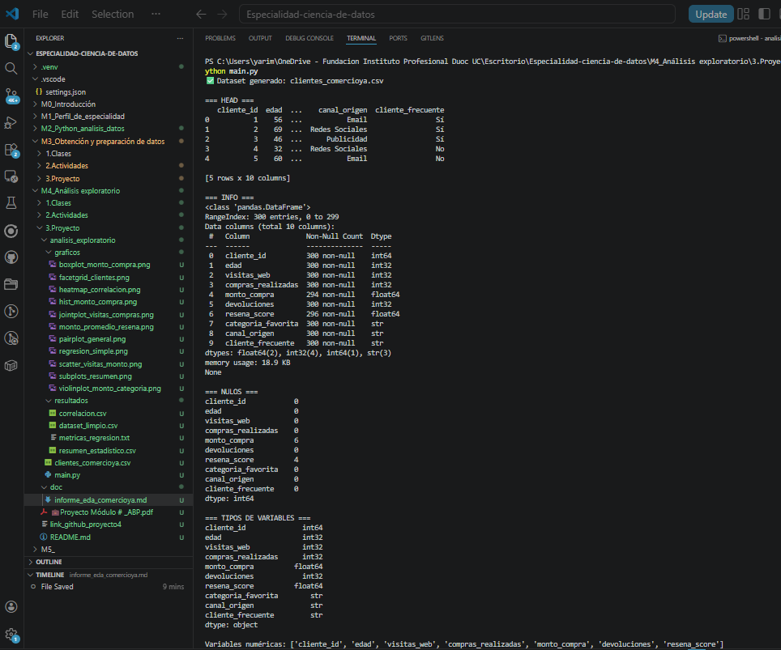
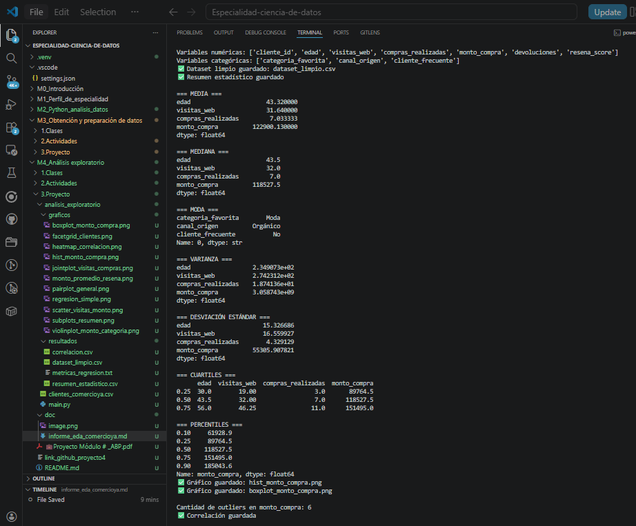
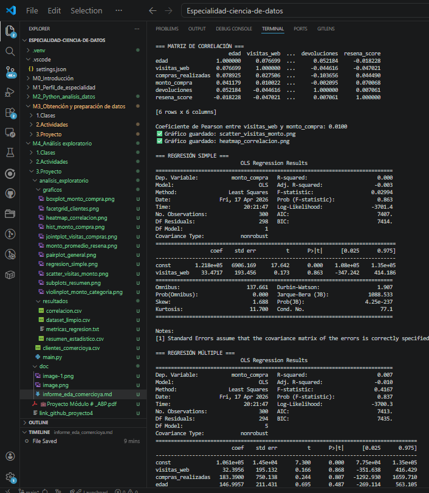
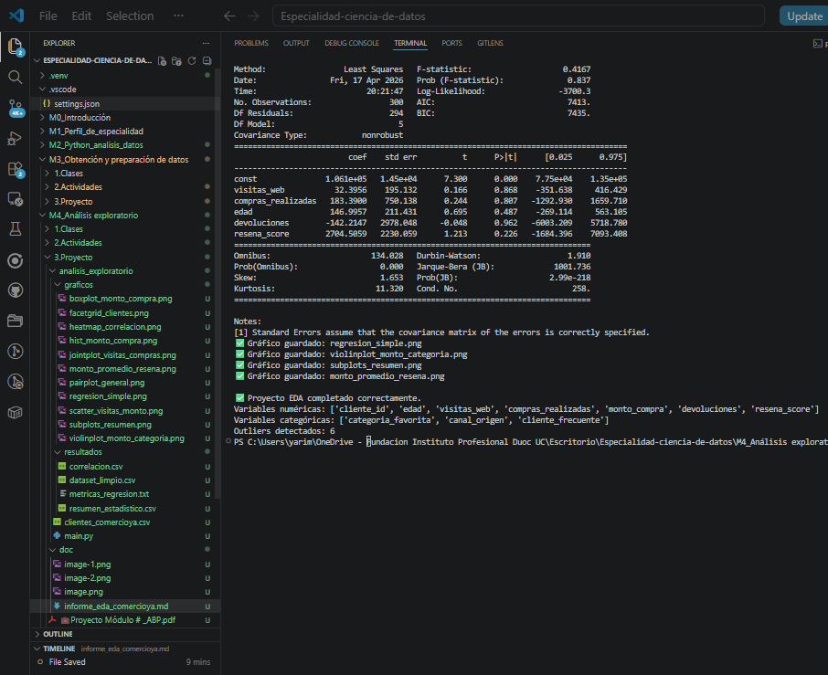

# Proyecto Integrador - Análisis Exploratorio de Datos para decisiones comerciales

## 1. Introducción

Este proyecto fue desarrollado para la empresa ComercioYA, dedicada a ventas en línea, con el objetivo de analizar datos históricos del comportamiento de sus clientes. El propósito del trabajo fue aplicar técnicas de análisis exploratorio de datos (EDA) para identificar patrones, relaciones, valores atípicos y variables relevantes que apoyen la toma de decisiones comerciales y de marketing.

El proyecto se desarrolló utilizando Python y librerías como Pandas, Seaborn, Matplotlib y Statsmodels.

---

## 2. Generación y revisión inicial del dataset

Se construyó un dataset con variables relacionadas con clientes, edad, visitas web, compras realizadas, monto de compra, devoluciones, reseñas, categoría favorita, canal de origen y condición de cliente frecuente.

En la etapa inicial se identificaron los tipos de variables, distinguiendo entre variables numéricas y categóricas. También se revisó la existencia de valores faltantes en algunas columnas, particularmente en `monto_compra` y `resena_score`. Estos valores fueron tratados mediante imputación usando la mediana y la moda, respectivamente.

---

## 3. Estadística descriptiva

Se calcularon medidas de tendencia central y dispersión para las principales variables numéricas:

- media
- mediana
- moda
- varianza
- desviación estándar
- cuartiles
- percentiles

Estas medidas permitieron conocer mejor la distribución de variables como `monto_compra`, `visitas_web` y `compras_realizadas`.

Además, se construyeron histogramas y boxplots para observar visualmente la distribución y detectar posibles valores atípicos.

---

## 4. Detección de valores atípicos

Se utilizó el método del rango intercuartílico (IQR) para identificar outliers en la variable `monto_compra`. Estos valores atípicos son relevantes porque pueden representar clientes con comportamientos de compra muy distintos al promedio, lo cual puede impactar tanto en el análisis estadístico como en la toma de decisiones comerciales.

---

## 5. Correlación entre variables

Se construyó una matriz de correlación para estudiar las relaciones entre variables numéricas. Además, se calculó el coeficiente de Pearson para evaluar la relación lineal entre `visitas_web` y `monto_compra`.

Los scatterplots y el heatmap facilitaron la interpretación visual de estas asociaciones. Esto permitió identificar qué variables podrían estar más relacionadas con el gasto de los clientes.

---

## 6. Regresión lineal

Se implementaron dos modelos de regresión:

- regresión lineal simple
- regresión lineal múltiple

La variable dependiente fue `monto_compra`. Como variables predictoras se utilizaron `visitas_web`, `compras_realizadas`, `edad`, `devoluciones` y `resena_score`.

Se evaluaron métricas como:

- R²
- MSE
- MAE

Además, se interpretaron los coeficientes y la significancia de los predictores, lo que permitió estimar cuáles variables aportan más a la explicación del monto de compra.

---

## 7. Análisis visual con Seaborn y Matplotlib

Se desarrollaron visualizaciones diversas para enriquecer el análisis:

- histogramas
- boxplots
- scatterplots
- heatmap
- pairplot
- violinplot
- jointplot
- FacetGrid
- subplots personalizados con Matplotlib

Estas visualizaciones permitieron observar distribuciones, comparar grupos, identificar patrones y comunicar los hallazgos de forma clara.

---

## 8. Hallazgos relevantes

Entre los hallazgos principales se observaron diferencias en el monto de compra según ciertas variables del cliente, presencia de valores atípicos en montos altos y relaciones entre frecuencia de interacción con la web y resultados de compra.

Las herramientas visuales ayudaron a comprender mejor la segmentación de clientes y su comportamiento de consumo.

---

## 9. Recomendaciones

- Priorizar campañas sobre segmentos con mayor frecuencia de compra.
- Analizar en detalle los clientes con montos muy altos para evaluar oportunidades de fidelización.
- Incorporar las variables más influyentes del análisis en futuros modelos predictivos.
- Continuar utilizando dashboards y visualizaciones para comunicar resultados al equipo directivo.

---

## 10. Conclusión

El análisis exploratorio de datos permitió comprender mejor el comportamiento de los clientes de ComercioYA y sentar una base sólida para decisiones estratégicas. Gracias al uso combinado de estadística descriptiva, correlación, regresión y visualización, fue posible obtener hallazgos relevantes y presentarlos de forma técnica y clara.

Este proyecto demuestra la importancia del EDA como paso previo a análisis más complejos y como herramienta clave para transformar datos en conocimiento útil para el negocio.

## 11. Anexos

