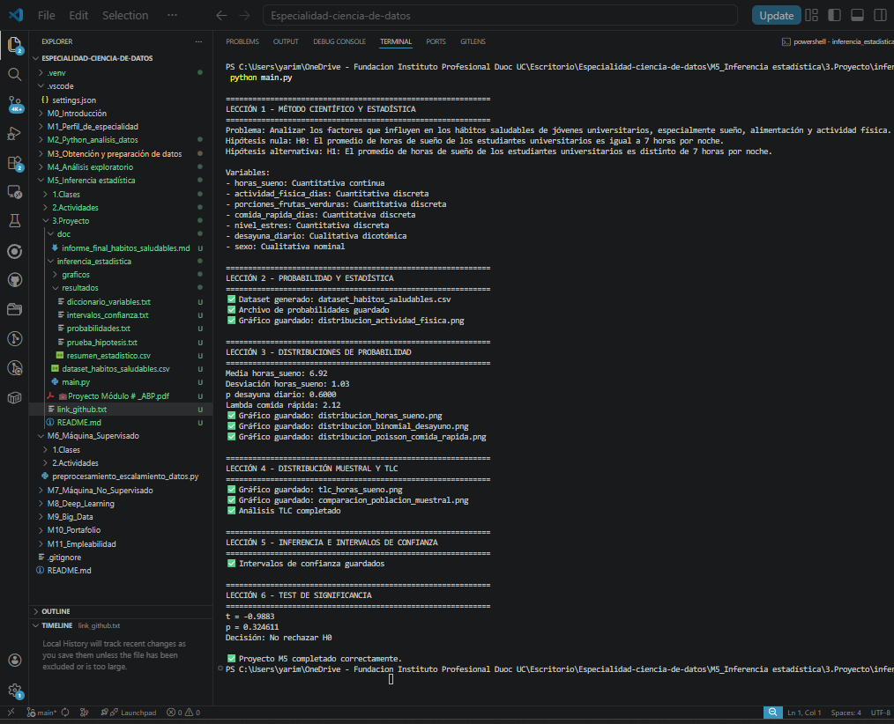

# Proyecto Integrador - Análisis estadístico sobre hábitos saludables en jóvenes universitarios

## 1. Introducción

El presente proyecto fue desarrollado para el área de salud universitaria de una institución pública, con el propósito de analizar factores relacionados con hábitos saludables en jóvenes universitarios. El interés principal del estudio es comprender patrones de sueño, alimentación y actividad física, con el fin de generar recomendaciones útiles para el bienestar estudiantil.

Para ello, se aplicó el método científico y se utilizaron herramientas de inferencia estadística, incluyendo simulación de datos, análisis de probabilidades, estudio de distribuciones, Teorema del Límite Central, intervalos de confianza y pruebas de hipótesis.

---

## 2. Lección 1: Método científico y estadística

### Problema de investigación
Se busca analizar si los estudiantes universitarios presentan hábitos saludables suficientes en relación con sueño, alimentación y actividad física.

### Hipótesis
- **Hipótesis nula (H0):** El promedio de horas de sueño de los estudiantes universitarios es igual a 7 horas por noche.
- **Hipótesis alternativa (H1):** El promedio de horas de sueño de los estudiantes universitarios es distinto de 7 horas por noche.

### Variables relevantes
- `horas_sueno`: cuantitativa continua
- `actividad_fisica_dias`: cuantitativa discreta
- `porciones_frutas_verduras`: cuantitativa discreta
- `comida_rapida_dias`: cuantitativa discreta
- `nivel_estres`: cuantitativa discreta
- `desayuna_diario`: cualitativa dicotómica
- `sexo`: cualitativa nominal

### Método científico aplicado
El estudio siguió las etapas del método científico: observación del problema, formulación de hipótesis, definición de variables, diseño metodológico, recolección o simulación de datos, análisis estadístico e interpretación de resultados.

---

## 3. Lección 2: Probabilidad y estadística

Se utilizó un diseño de **muestreo aleatorio simple simulado**, generando un conjunto de datos con 150 registros de estudiantes universitarios.

Se calcularon probabilidades básicas sobre eventos relacionados con desayunar diariamente y realizar actividad física frecuente, incluyendo:
- probabilidad simple
- intersección
- unión
- complemento

Este paso permitió modelar eventos aleatorios dentro del contexto del estudio.

---

## 4. Lección 3: Distribución de probabilidad

Se analizaron distintas variables según el tipo de distribución más adecuada:

- **Normal** para `horas_sueno`, por tratarse de una variable continua.
- **Binomial** para `desayuna_diario`, al modelar éxito o fracaso.
- **Poisson** para `comida_rapida_dias`, al representar frecuencia de ocurrencia.

Se calcularon probabilidades usando las funciones correspondientes y se graficaron las distribuciones para facilitar su interpretación.

---

## 5. Lección 4: Distribución muestral y Teorema del Límite Central

Se generaron distribuciones muestrales de la media para la variable `horas_sueno` utilizando distintos tamaños muestrales (5, 30 y 50).

Esto permitió verificar empíricamente el **Teorema del Límite Central**, observando que a medida que aumenta el tamaño de la muestra, la distribución de las medias muestrales tiende a aproximarse a una distribución normal y la dispersión disminuye.

También se comparó visualmente la distribución poblacional con la distribución muestral.

---

## 6. Lección 5: Inferencia e intervalos de confianza

Se calcularon intervalos de confianza para la media de dos variables:
- `horas_sueno`
- `actividad_fisica_dias`

Se consideraron tres niveles de confianza:
- 90%
- 95%
- 99%

Esto permitió analizar cómo cambia el ancho del intervalo según el nivel de confianza y el tamaño muestral. A mayor nivel de confianza, mayor amplitud del intervalo. A mayor tamaño muestral, mayor precisión de la estimación.

---

## 7. Lección 6: Test de significancia

Se realizó una prueba de hipótesis para contrastar si el promedio de horas de sueño de los estudiantes es igual a 7 horas.

Se utilizó una prueba t para una muestra, calculando:
- estadístico t
- valor-p
- decisión estadística según α = 0.05

Además, se explicaron:
- **Error tipo I:** rechazar la hipótesis nula siendo verdadera
- **Error tipo II:** no rechazar la hipótesis nula siendo falsa

Este análisis permitió determinar si existe evidencia estadística suficiente para afirmar que el promedio de horas de sueño difiere de 7 horas.

---

## 8. Hallazgos generales

Los resultados obtenidos permiten identificar tendencias en los hábitos saludables de los estudiantes universitarios. A partir de la simulación y del análisis estadístico, fue posible observar comportamientos relacionados con el sueño, la alimentación y la actividad física.

El uso de herramientas de inferencia permitió pasar de una simple descripción de datos a conclusiones más fundamentadas sobre la población objetivo.

---

## 9. Recomendaciones

- Fortalecer programas de educación en hábitos de sueño saludable.
- Diseñar campañas de promoción de actividad física en estudiantes.
- Incentivar alimentación saludable y desayuno diario.
- Repetir este estudio con datos reales para validar los hallazgos observados.
- Utilizar estos resultados como base para nuevas políticas de bienestar universitario.

---

## 10. Conclusión

El proyecto permitió aplicar de forma integrada los contenidos del módulo de inferencia estadística, combinando método científico, probabilidad, distribuciones, muestreo, TLC, intervalos de confianza y pruebas de hipótesis.

Gracias a este enfoque, se logró construir una investigación estadística coherente y metodológicamente justificada, aportando evidencia útil para comprender y mejorar los hábitos saludables en jóvenes universitarios.

## 11. Anexos

