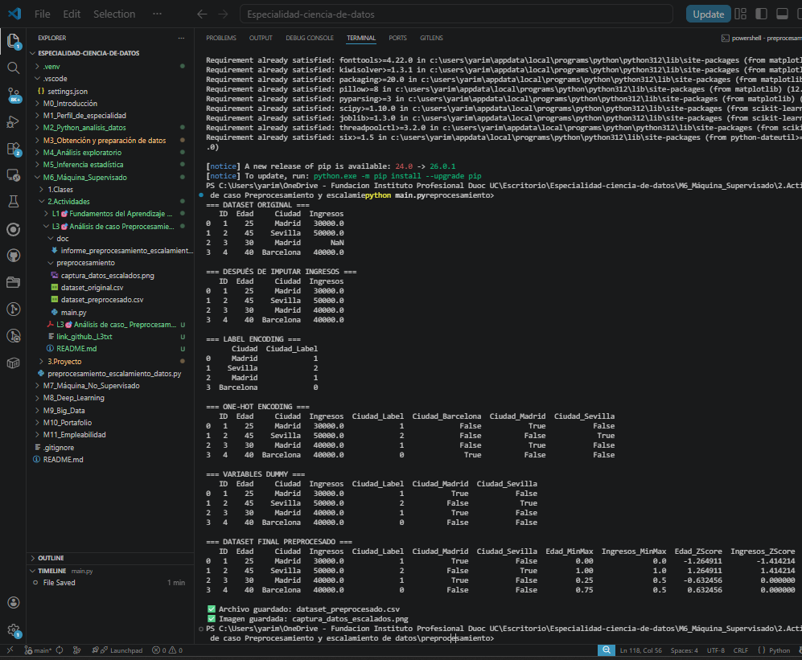

# Análisis de Caso - Preprocesamiento y escalamiento de datos

## 1. Introducción

En esta actividad se trabajó con un pequeño conjunto de datos proporcionado por el cliente, correspondiente a información demográfica y económica de clientes de una cadena de supermercados. El objetivo fue realizar un proceso de preprocesamiento y escalamiento para dejar los datos listos para una futura etapa de modelado predictivo.

Las tareas realizadas incluyeron imputación de valores faltantes, codificación de variables categóricas y aplicación de técnicas de escalamiento sobre variables numéricas.

---

## 2. Descripción de cada etapa aplicada

### 2.1 Imputación del valor faltante
Se identificó un valor faltante en la columna `Ingresos`. Para resolverlo, se utilizó la estrategia de imputación por media, reemplazando el valor nulo por el promedio de los ingresos disponibles.

### 2.2 Label Encoding
La variable categórica `Ciudad` fue transformada en valores numéricos enteros mediante Label Encoding. Este método asigna un número distinto a cada categoría.

### 2.3 One-Hot Encoding
También se aplicó One-Hot Encoding a la variable `Ciudad`, generando una nueva columna binaria para cada ciudad. Esto permite representar categorías sin imponer un orden numérico artificial.

### 2.4 Variables Dummy
Se aplicó además el método de Variables Dummy, que es similar al One-Hot Encoding, pero eliminando una de las columnas para evitar redundancia entre variables.

### 2.5 Escalamiento
Las columnas numéricas `Edad` e `Ingresos` fueron escaladas con dos técnicas:

- **Normalización Min-Max:** transforma los valores a un rango entre 0 y 1.
- **Estandarización Z-Score:** transforma los valores para que tengan media 0 y desviación estándar 1.

---

## 3. Respuestas a las preguntas de reflexión

### ¿Por qué es importante realizar estas tareas antes de entrenar un modelo de Machine Learning?

Estas tareas son importantes porque los modelos de Machine Learning necesitan datos limpios, consistentes y en un formato adecuado. Si existen valores nulos, categorías sin codificar o diferencias muy grandes de escala entre variables, el modelo puede aprender mal, perder precisión o incluso no funcionar correctamente.

El preprocesamiento mejora la calidad de los datos y el escalamiento evita que variables con valores más grandes dominen el entrenamiento.

### ¿Qué diferencias observaste entre la normalización y la estandarización?

La principal diferencia es que la **normalización Min-Max** lleva los datos a un rango fijo entre 0 y 1, mientras que la **estandarización Z-Score** centra los datos en torno a media 0 y desviación estándar 1.

La normalización es útil cuando se necesita trabajar con escalas acotadas, mientras que la estandarización es más útil cuando los modelos asumen distribuciones centradas o cuando existen valores fuera de una escala uniforme.

---

## 4. Conclusión

El proceso realizado permitió transformar un conjunto de datos inicial en un dataset más adecuado para análisis predictivo. La imputación, codificación y escalamiento son pasos fundamentales en cualquier proyecto de ciencia de datos, ya que mejoran la calidad del conjunto de datos y facilitan el entrenamiento correcto de modelos de Machine Learning.

## Anexos

