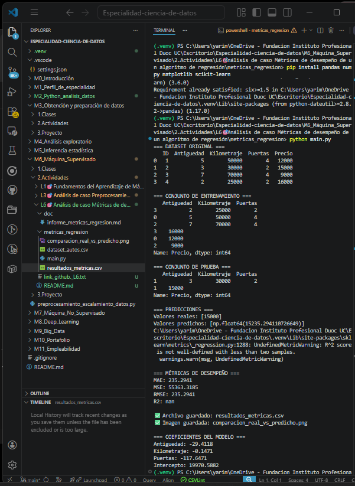

# Análisis de Caso - Métricas de desempeño de un algoritmo de regresión

## 1. Introducción

En esta actividad se trabajó con un conjunto de datos de vehículos usados proporcionado por AutoPredict S.A., con el objetivo de construir y evaluar un modelo de regresión lineal capaz de predecir el precio de venta de un automóvil en función de su antigüedad, kilometraje y número de puertas.

Para ello, se utilizó Python y Scikit-Learn, aplicando un flujo básico de entrenamiento, predicción y evaluación mediante métricas de desempeño.

---

## 2. Etapas realizadas

### 2.1 Preparación de los datos
Se construyó un DataFrame con la información entregada por el cliente, utilizando las variables:
- `Antiguedad`
- `Kilometraje`
- `Puertas`

como variables independientes, y la variable:
- `Precio`

como variable dependiente.

### 2.2 División del dataset
El conjunto de datos fue dividido en:
- 80% para entrenamiento
- 20% para prueba

Esto permitió entrenar el modelo en una parte de los datos y luego evaluar su capacidad predictiva en datos no vistos.

### 2.3 Entrenamiento del modelo
Se utilizó un modelo de **Regresión Lineal**, ya que el objetivo es predecir un valor numérico continuo.

### 2.4 Predicción
Una vez entrenado el modelo, se realizaron predicciones sobre el conjunto de prueba.

### 2.5 Evaluación con métricas
Se calcularon las siguientes métricas:
- **MAE (Mean Absolute Error):** mide el error absoluto promedio entre valores reales y predichos.
- **MSE (Mean Squared Error):** mide el promedio de los errores al cuadrado.
- **RMSE (Root Mean Squared Error):** representa la raíz del error cuadrático medio y está en la misma unidad que el precio.
- **R²:** indica qué tan bien el modelo explica la variabilidad de la variable objetivo.

---

## 3. Interpretación de las métricas

Las métricas obtenidas permiten analizar el nivel de precisión del modelo. En general:

- Un **MAE bajo** indica que el error promedio de predicción es pequeño.
- Un **MSE bajo** indica que no hay errores muy grandes de predicción.
- Un **RMSE bajo** muestra que el modelo predice con buena cercanía al valor real.
- Un **R² cercano a 1** indica un mejor ajuste del modelo.

Sin embargo, en este caso debe considerarse que el dataset es extremadamente pequeño, con solo 4 registros, por lo que las métricas obtenidas no son suficientes para afirmar que el modelo sea sólido o generalizable.

---

## 4. ¿Qué tan preciso es el modelo?

El modelo puede generar una predicción, pero su precisión real es limitada debido al tamaño muy reducido del conjunto de datos. Con solo 4 observaciones, el modelo no tiene suficiente información para aprender patrones confiables. Por lo tanto, aunque las métricas puedan parecer aceptables o no, no se puede considerar este modelo como suficientemente robusto para producción.

---

## 5. Decisiones para mejorar el desempeño

Para mejorar el modelo, se proponen las siguientes acciones:

- recopilar una mayor cantidad de datos de vehículos usados,
- incluir más variables relevantes, como marca, modelo, combustible, transmisión o estado del vehículo,
- realizar validación cruzada en un dataset más amplio,
- analizar posibles relaciones no lineales,
- comparar la regresión lineal con otros algoritmos de regresión más avanzados.

---

## 6. Gráfico comparativo

Se generó un gráfico comparando el valor real y el valor predicho para el conjunto de prueba. Esta visualización permite observar de forma directa la cercanía entre ambos valores y complementar el análisis cuantitativo realizado con las métricas.

---

## 7. Conclusión

La actividad permitió aplicar un flujo básico de evaluación de un modelo de regresión lineal mediante métricas de desempeño. Aunque el procedimiento fue correcto, el tamaño del dataset limita fuertemente la calidad de las conclusiones. Aun así, el ejercicio sirve para comprender cómo evaluar un modelo y qué decisiones pueden tomarse para mejorarlo antes de implementarlo en un entorno real.

## Anexos

