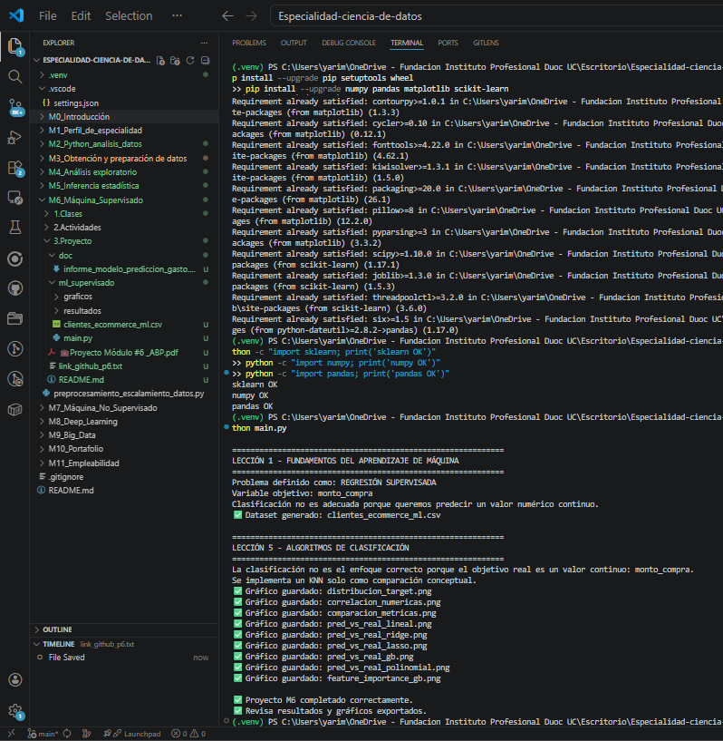

# Proyecto Integrador - Predicción inteligente de gasto en clientes e-commerce

## 1. Introducción

Este proyecto fue desarrollado para el Departamento de Analítica Comercial de una empresa de e-commerce, con el objetivo de predecir el monto promedio de compra de un cliente a partir de variables demográficas y de comportamiento digital. La necesidad del negocio es personalizar ofertas y optimizar la estrategia de marketing utilizando modelos predictivos robustos y confiables.

Para responder a este objetivo, se implementó un pipeline completo de aprendizaje supervisado de tipo regresión, incluyendo generación y preparación de datos, preprocesamiento, validación cruzada, comparación de algoritmos, evaluación con métricas, optimización de hiperparámetros y selección de un modelo final.

---

## 2. Lección 1: Fundamentos del aprendizaje de máquina

El problema fue definido como un problema de **regresión supervisada**, ya que la variable objetivo, `monto_compra`, es cuantitativa continua. Esto significa que no corresponde utilizar un enfoque de clasificación para resolver el objetivo principal del negocio.

Además, se identificaron las etapas del pipeline de ML:
- definición del problema
- obtención o simulación de datos
- preprocesamiento
- división entrenamiento/prueba
- entrenamiento de modelos
- validación y evaluación
- optimización
- selección del modelo final

---

## 3. Lección 2: Nivel de ajuste del modelo y validación cruzada

Se dividió el conjunto de datos en entrenamiento y prueba, permitiendo comparar el comportamiento de los modelos en ambas particiones. Esto hizo posible detectar sobreajuste o subajuste mediante la comparación entre desempeño en entrenamiento y en test.

También se aplicó validación cruzada con K-Folds para obtener una evaluación más robusta, disminuyendo la dependencia de una sola partición de datos.

---

## 4. Lección 3: Preprocesamiento y escalamiento de datos

Se trataron valores nulos en variables numéricas mediante imputación por mediana y en variables categóricas mediante moda. También se aplicó codificación one-hot a variables categóricas y escalamiento estándar a variables numéricas.

Se consideró además el tratamiento de outliers en la variable objetivo utilizando una estrategia basada en IQR, limitando valores extremos para estabilizar el entrenamiento.

---

## 5. Lección 4: Regresiones

Se implementaron modelos de:
- regresión lineal
- regresión polinomial

Ambos fueron comparados en términos de ajuste y precisión. La regresión lineal permitió una interpretación más directa de la relación entre variables, mientras que la regresión polinomial aportó flexibilidad para captar relaciones no lineales.

---

## 6. Lección 5: Algoritmos de clasificación

Se analizó conceptualmente por qué la clasificación no es adecuada para este problema, ya que el objetivo del negocio es estimar un monto numérico y no asignar etiquetas de clase.

Aun así, se implementó un clasificador KNN sobre una versión categorizada del gasto como ejercicio comparativo, mostrando que aunque puede clasificar niveles de gasto, no responde con precisión al objetivo original del proyecto.

---

## 7. Lección 6: Métricas de desempeño

Se evaluaron los modelos utilizando:
- MAE
- MSE
- RMSE
- R²

Estas métricas permitieron comparar de forma objetiva los distintos enfoques, tanto en entrenamiento como en prueba. Se elaboró una tabla comparativa para facilitar la interpretación.

---

## 8. Lección 7: Optimización del modelo

Se aplicó ingeniería de características de manera implícita mediante expansión polinomial y se usaron técnicas de regularización con Ridge y Lasso para controlar complejidad.

Además, se realizó ajuste de hiperparámetros mediante `GridSearchCV`, mejorando el desempeño y la robustez de los modelos optimizados.

---

## 9. Lección 8: Boosting

Se implementó `GradientBoostingRegressor` como modelo avanzado de ensemble. Este algoritmo fue comparado frente a los modelos lineales y regularizados.

Entre sus ventajas destacan:
- capacidad para modelar relaciones complejas
- buen desempeño predictivo
- robustez frente a interacciones no lineales

Entre sus limitaciones:
- menor interpretabilidad que un modelo lineal
- mayor complejidad de ajuste
- más costo computacional

---

## 10. Hallazgos generales

El proyecto mostró que un pipeline estructurado de aprendizaje supervisado permite transformar datos históricos en una herramienta útil para la toma de decisiones comerciales. La comparación de algoritmos evidenció diferencias en ajuste, estabilidad y precisión, lo que permitió seleccionar un modelo final mejor fundamentado.

También se observó que el preprocesamiento correcto y la validación cruzada son etapas críticas para obtener resultados confiables.

---

## 11. Justificación del modelo final

El modelo final se seleccionó en función de su desempeño en test, su comportamiento en validación cruzada y su robustez general. La elección no se basó solo en una métrica aislada, sino en el equilibrio entre precisión, generalización y consistencia.

Esto permite entregar a la empresa una solución más confiable para estimar el gasto esperado de clientes y orientar decisiones de marketing personalizado.

---

## 12. Recomendaciones

- utilizar el modelo final como apoyo a campañas segmentadas
- complementar el análisis con datos reales de comportamiento reciente
- monitorear el desempeño del modelo en producción
- reentrenar periódicamente con nuevos datos
- explorar futuros modelos ensemble o boosting más avanzados si el negocio lo requiere

---

## 13. Conclusión

Este proyecto permitió implementar un caso completo de aprendizaje de máquina supervisado aplicado a un contexto real de e-commerce. Se cubrieron todas las etapas relevantes del pipeline, desde la definición del problema hasta la optimización y evaluación final del modelo.

Como resultado, se construyó una base sólida para una solución predictiva orientada a negocio, integrando fundamentos técnicos y capacidad de comunicación analítica.

## Anexos

