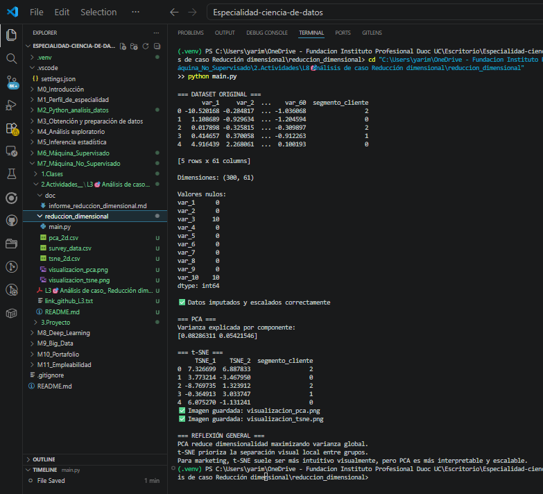

# Análisis de Caso - Reducción dimensional

## 1. Introducción

En esta actividad se trabajó con un conjunto de datos de alta dimensionalidad, simulando un escenario similar al de encuestas masivas de clientes con más de 50 variables. El objetivo fue aplicar técnicas de reducción dimensional para mejorar la comprensión de los datos y facilitar la identificación de agrupamientos naturales de clientes.

Para ello, se utilizaron dos métodos: **PCA** y **t-SNE**, generando una visualización 2D para cada uno y comparando sus resultados.

---

## 2. Etapas del análisis

### 2.1 Carga y exploración de datos
Se generó un dataset simulado con 300 registros y 60 variables numéricas, además de una variable de grupo o segmento de cliente. También se introdujeron algunos valores nulos de forma controlada para simular un escenario real.

### 2.2 Limpieza de datos
Se trataron los valores nulos mediante imputación por media, con el fin de evitar la pérdida de registros y dejar el dataset apto para modelado.

### 2.3 Escalamiento
Se aplicó **StandardScaler**, ya que tanto PCA como t-SNE funcionan mejor cuando las variables están en una escala comparable.

### 2.4 Aplicación de PCA
Se redujo la dimensionalidad a dos componentes principales. PCA permitió conservar la mayor cantidad posible de varianza global del conjunto de datos, facilitando una representación resumida y más interpretable.

### 2.5 Aplicación de t-SNE
También se aplicó t-SNE para obtener una representación 2D enfocada en preservar las relaciones locales entre observaciones. Esto permitió observar con mayor claridad los posibles agrupamientos entre segmentos de clientes.

---

## 3. Comparación entre PCA y t-SNE

En la visualización con **PCA**, los grupos pueden observarse de manera general, pero la separación no siempre es completamente clara. Esto se debe a que PCA es una técnica lineal y su objetivo principal es resumir la varianza del conjunto de datos.

En cambio, la visualización con **t-SNE** suele mostrar agrupamientos más definidos y visualmente intuitivos, ya que está diseñada para preservar estructuras locales y resaltar similitudes entre observaciones cercanas.

---

## 4. Técnica recomendada

Si el objetivo es presentar **insights visuales al equipo de marketing**, la técnica más recomendable sería **t-SNE**, porque normalmente ofrece una separación visual más clara entre grupos de clientes, lo que facilita la interpretación de patrones y segmentos.

Sin embargo, si se busca una técnica más rápida, reproducible e interpretable matemáticamente, **PCA** puede ser una mejor opción.

---

## 5. Principales hallazgos

- La reducción dimensional facilita la interpretación de datasets con muchas variables.
- PCA resume la información general del dataset.
- t-SNE permite observar agrupamientos de clientes con mayor claridad visual.
- Ambas técnicas son útiles, pero responden a necesidades distintas.

---

## 6. Reflexión crítica

Entre las limitaciones de **PCA**, se encuentra que puede no capturar relaciones no lineales complejas entre variables. Por su parte, **t-SNE** ofrece mejores visualizaciones, pero puede ser más lento, más sensible a parámetros como la perplexity y menos interpretable desde un punto de vista matemático.

Si el volumen de datos fuera mucho mayor, sería recomendable considerar primero una reducción preliminar con PCA y luego aplicar t-SNE sobre una muestra o subconjunto, para reducir tiempos de procesamiento y mantener una visualización comprensible.

---

## 7. Conclusión

La actividad permitió aplicar dos técnicas de reducción dimensional a un problema de alta complejidad de variables. Tanto PCA como t-SNE aportan valor, pero su utilidad depende del objetivo del análisis. En este caso, para visualización ejecutiva y exploración de segmentos, t-SNE resulta más conveniente, mientras que PCA sigue siendo una herramienta sólida para resumir información y preparar datos para análisis posteriores.

## Anexos

