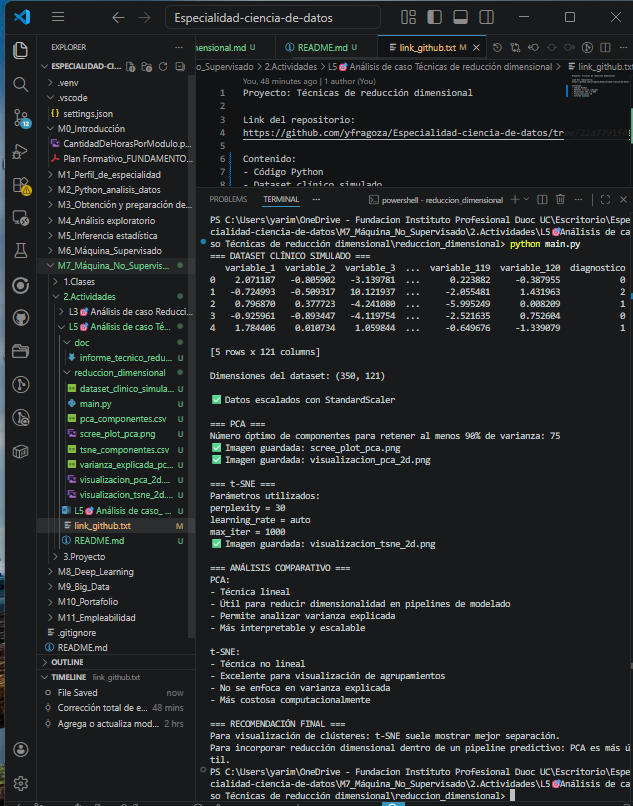

# Análisis de Caso - Técnicas de reducción dimensional

## 1. Introducción

En esta actividad se trabajó con un dataset clínico de alta dimensionalidad, simulando un escenario real en el que un centro médico busca mejorar el rendimiento de modelos de clasificación para diagnóstico temprano de enfermedades neurodegenerativas. El conjunto de datos contiene más de 100 variables por paciente, lo que puede generar sobreajuste, altos tiempos de cómputo y baja interpretabilidad. Por ello, se aplicaron técnicas de reducción dimensional para simplificar la información y mejorar la visualización de patrones. Esta actividad responde exactamente a la consigna de aplicar StandardScaler, PCA y t-SNE sobre un dataset clínico y entregar una recomendación técnica final. :contentReference[oaicite:2]{index=2}

## 2. Justificación del uso de reducción dimensional

La reducción dimensional es útil cuando se trabaja con muchas variables, ya que permite:
- disminuir la complejidad del dataset,
- reducir tiempos de procesamiento,
- facilitar la visualización de patrones,
- disminuir el riesgo de sobreajuste,
- mejorar la interpretabilidad.

En este caso, se eligieron dos técnicas:
- **PCA**, por su capacidad para resumir la varianza del conjunto de datos,
- **t-SNE**, por su capacidad para representar mejor estructuras locales y posibles clústeres.

## 3. Aplicación de StandardScaler

Antes de aplicar PCA y t-SNE, se utilizó **StandardScaler** para escalar las variables numéricas. Esto fue necesario porque ambas técnicas son sensibles a diferencias de escala entre variables. El escalamiento permitió que todas las variables aportaran de manera comparable al análisis.

## 4. Resultados de PCA

Se aplicó PCA primero sobre todas las variables para calcular la varianza explicada. Luego se utilizó un criterio de retención basado en un 90% de varianza acumulada, obteniendo así el número óptimo de componentes.

### Hallazgos principales de PCA
- PCA permitió resumir la información del dataset en un número menor de componentes.
- La visualización 2D mostró una separación parcial entre grupos.
- La técnica fue útil para entender cuánta información se conserva en cada componente.
- PCA resulta especialmente útil cuando se necesita reducción dimensional como parte de un pipeline de modelado predictivo.

## 5. Resultados de t-SNE

Se aplicó t-SNE con los parámetros:
- `perplexity = 30`
- `learning_rate = auto`
- `max_iter = 1000`

### Hallazgos principales de t-SNE
- La visualización 2D mostró agrupamientos más claros que PCA.
- Los grupos de diagnóstico se observaron de forma más separada visualmente.
- t-SNE fue más útil para explorar patrones complejos y presentarlos a equipos no técnicos.

## 6. Comparativa técnica

### PCA
**Ventajas**
- Técnica lineal e interpretable.
- Permite medir varianza explicada.
- Es rápida y escalable.
- Se integra bien en pipelines predictivos.

**Desventajas**
- Puede no capturar relaciones no lineales.
- La separación visual de grupos puede ser limitada.

### t-SNE
**Ventajas**
- Excelente para visualización en 2D.
- Resalta agrupamientos locales de forma clara.
- Muy útil para presentaciones y análisis exploratorio.

**Desventajas**
- Más costosa computacionalmente.
- Menos interpretable matemáticamente.
- No es ideal como paso estable dentro de un pipeline predictivo.

## 7. Recomendación final

Si el objetivo es **presentar insights visuales al equipo de visualización o a áreas de negocio**, la mejor técnica es **t-SNE**, ya que muestra agrupamientos más claros y comprensibles.

Si el objetivo es **integrar la reducción dimensional en un pipeline de modelado predictivo**, la técnica más recomendable es **PCA**, porque es más estable, interpretable y eficiente.

## 8. Reflexión individual

En esta actividad aprendí que PCA y t-SNE pueden reducir la dimensionalidad del mismo dataset, pero cada uno sirve para propósitos distintos. PCA me ayudó a entender cómo resumir la información preservando varianza, mientras que t-SNE me permitió visualizar mejor agrupamientos complejos. La principal dificultad fue entender que una técnica no reemplaza completamente a la otra, sino que se deben elegir según el objetivo: interpretación y modelado en el caso de PCA, y visualización clara en el caso de t-SNE.

## 9.Anexos

